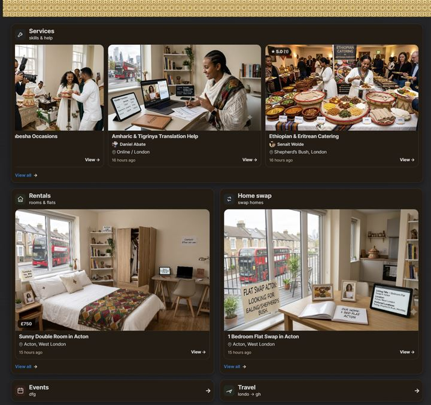
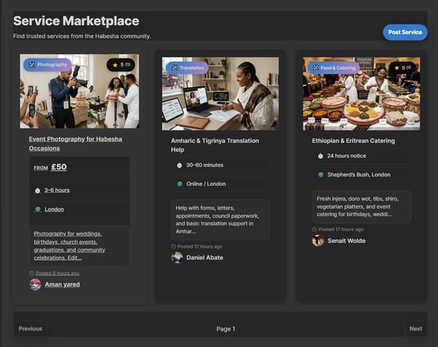
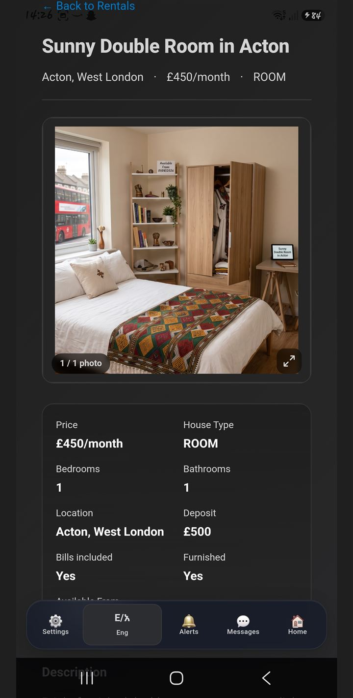
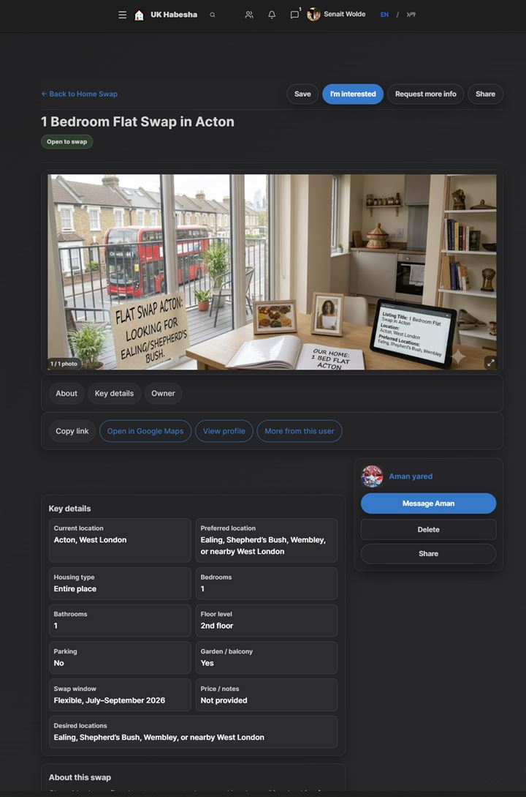

# Mihretab Nega — Full-Stack Developer Portfolio

**Live site:** [https://mihretab.org](https://mihretab.org)

A modern, cinematic one-page portfolio for Mihretab Nega, a London-based full-stack developer building real-world **React + Spring Boot** applications: booking systems, community platforms, job tools, automation, and business management software.

## Screenshots

Real product screenshots from the featured UK Habesha community platform:

| Community feed | Local services | Rental detail | Marketplace |
| --- | --- | --- | --- |
|  |  |  |  |

## Features

- Cinematic photo slideshow background with Ken Burns pan/zoom, aurora glows, rotating rings, and rising light particles
- Frosted-glass (glassmorphism) UI — transparent cards, pill navbar, and glass buttons with sheen hover animations
- Sticky glass navbar with mobile hamburger drawer, scroll-spy active links, GitHub/LinkedIn buttons, and a "Let's Build" CTA
- Hero with rotating role line, tech badges, floating animated project cards, and CV download
- Featured projects with category filters, real screenshots, case-study modals (problem, solution, features, what I built), live demo + frontend/backend GitHub links
- Accordion-style About timeline and Process steps; collapsible Services details — mobile-first, tap-friendly
- Working contact form (Formspree) with validation and direct email/WhatsApp/LinkedIn/GitHub links
- SEO: meta description, Open Graph, Twitter cards, JSON-LD, sitemap, robots.txt
- Fully responsive (mobile-first) and honors `prefers-reduced-motion`

## Featured projects

| Project | Stack | Links |
| --- | --- | --- |
| Habesha Community Platform / UK Habesha | React, Spring Boot, PostgreSQL, JWT | [Demo](https://habesha-community-frontend.netlify.app) · [Frontend](https://github.com/2118476/Habesha-community-Frontend) · [Backend](https://github.com/2118476/Habesha-community-backend) |
| Hair Salon Booking System | Java, Spring Boot, MySQL, React, JWT | [Demo](https://sparkling-gaufre-95d8cc.netlify.app) · [Frontend](https://github.com/2118476/hair-salon-frontend) · [Backend](https://github.com/2118476/hair-salon-backend) |
| SMS and Voice IVR App | React, Spring Boot, MySQL, Twilio | [Demo](https://gorgeous-cendol-eb18cc.netlify.app/) · [Code](https://github.com/2118476/Mms) |
| JobPilot / Job Search Assistant | React, Supabase, PostgreSQL | In development |
| GoldSignal / Trading Signal Platform | Python, MT5, React, Spring Boot | [Code](https://github.com/2118476/bot15COrv5-15b-18v4) |
| Enku Habesha / Business & Order Management | React, Java, Spring Boot, MySQL | Private business tool |

## Tech stack

- **Frontend:** React 19, SCSS modules, Framer Motion, FontAwesome
- **Forms:** Formspree
- **Tooling:** Create React App (react-scripts), Sass
- **Hosting:** Netlify (see `my-react-app/netlify.toml`)

## Project structure

```
my-react-app/
├── public/                 # index.html (SEO/OG/JSON-LD), CV, sitemap, robots.txt
├── src/
│   ├── assets/             # profile photo, background photos, project screenshots
│   ├── components/
│   │   ├── layout/         # Navbar, Footer, Section, Container
│   │   ├── ui/             # Button, Badge, Modal, Collapse, ScrollToTop
│   │   ├── AmbientBackground.jsx   # cinematic slideshow background layer
│   │   └── ContactForm.jsx
│   ├── data/               # projects.js, skills.js (edit content here)
│   ├── sections/           # Hero, About, Projects, Services, Skills, Process, Trust, Contact
│   └── styles/             # design tokens (variables.scss), mixins, globals
└── netlify.toml            # Netlify build configuration
```

## Getting started

```bash
cd my-react-app
npm install
npm start        # dev server at http://localhost:3000
npm run build    # production build in my-react-app/build
```

## Contact form setup

The contact form posts to [Formspree](https://formspree.io). The endpoint is read from
an environment variable, with a working default baked in:

1. Copy `my-react-app/.env.example` to `my-react-app/.env`.
2. Create a form at [formspree.io](https://formspree.io) and set
   `REACT_APP_FORMSPREE_ENDPOINT=https://formspree.io/f/<your-id>`.
3. Restart the dev server (CRA reads env vars at startup).

If the variable is unset, the form uses the default portfolio endpoint. If it is set
to an empty value, the form falls back to opening the visitor's email app with the
message pre-filled (`mailto:`). On any submission error, the UI also shows a direct
`mailto:` link — visitors are never left with a dead form.

## Deployment

The site deploys to Netlify. Build command `npm run build`, publish directory `build`, configured in `my-react-app/netlify.toml`.

## Future improvements

- Dedicated case-study pages per project (e.g. `/projects/habesha-community`) via Next.js or React Router
- Real client testimonials in the Trust section
- Blog/articles for SEO

## Contact

- **Email:** [mihretabtesfahun2124@gmail.com](mailto:mihretabtesfahun2124@gmail.com)
- **LinkedIn:** [linkedin.com/in/mihretab-nega-56292819a](https://www.linkedin.com/in/mihretab-nega-56292819a/)
- **GitHub:** [github.com/2118476](https://github.com/2118476)
